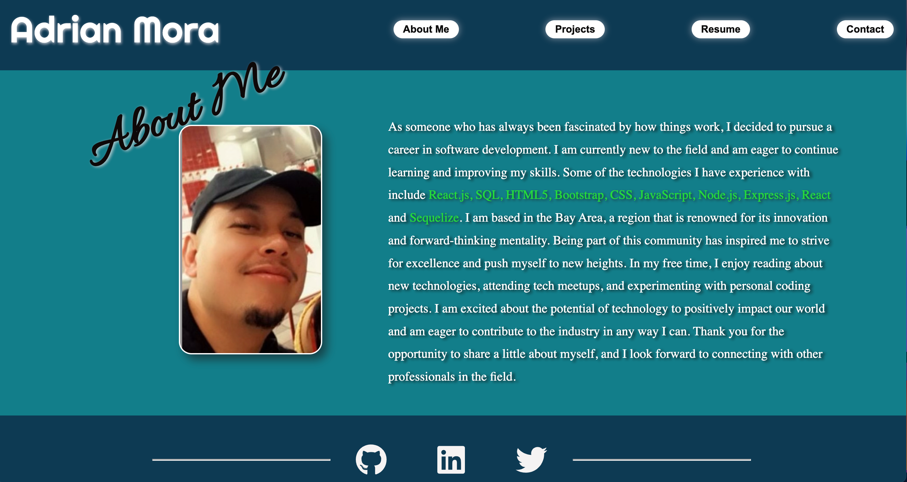

# Adrian Mora portfolio
<br>
<p align="center">
    
    
    
    
</p>


## Table of Contents
- [License](#license)
- [Overview](#overview)
- [Built With](#built-with)
- [Live Preview](#Live-Preview)
- [Contact](#contact)


## License

 

Copyright © 2007 Free Software Foundation, Inc. <https://fsf.org/>

Everyone is permitted to copy and distribute verbatim copies of this license document, but changing it is not allowed.

## Overview

```
GIVEN a single-page application portfolio for a web developer
WHEN I load the portfolio
THEN I am presented with a page containing a header, a section for content, and a footer
WHEN I view the header
THEN I am presented with the developer's name and navigation with titles corresponding to different sections of the portfolio
WHEN I view the navigation titles
THEN I am presented with the titles About Me, Portfolio, Contact, and Resume, and the title corresponding to the current section is highlighted
WHEN I click on a navigation title
THEN I am presented with the corresponding section below the navigation without the page reloading and that title is highlighted
WHEN I load the portfolio the first time
THEN the About Me title and section are selected by default
WHEN I am presented with the About Me section
THEN I see a recent photo or avatar of the developer and a short bio about them
WHEN I am presented with the Portfolio section
THEN I see titled images of six of the developer’s applications with links to both the deployed applications and the corresponding GitHub repository
WHEN I am presented with the Contact section
THEN I see a contact form with fields for a name, an email address, and a message
WHEN I move my cursor out of one of the form fields without entering text
THEN I receive a notification that this field is required
WHEN I enter text into the email address field
THEN I receive a notification if I have entered an invalid email address
WHEN I am presented with the Resume section
THEN I see a link to a downloadable resume and a list of the developer’s proficiencies
WHEN I view the footer
THEN I am presented with text or icon links to the developer’s GitHub and LinkedIn profiles, and their profile on a third platform (Stack Overflow, Twitter) 
```


### Built With

<br>

    [JavaScript](https://devdocs.io/javascript/)

    [nodeJS](https://nodejs.org/en/docs/)

     [React](https://legacy.reactjs.org/docs/getting-started.html)

    [NPM](https://www.npmjs.com/)

## Live Preview

<p align="center">
      
</p>


[Click Here For Live website](https://moraadrian510.github.io/Portfolio_2/)

## Contact


If you would like to contribute or have any questions , please contact us through <u>**GitHub**</u>:

 [GitHub](https://github.com/moraadrian510)

 [Email](mailto:moraadrian510@icloud.com)

**Thank You for your feedback!!**

---